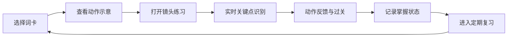
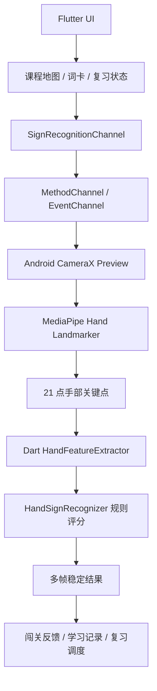

<div align="center">
  

  <h1>Silent Voice</h1>
  <p><strong>让手语像学英语单词一样可学习、可闯关、可复习、可长期积累</strong></p>

  <p>
    
    
    
    
  </p>

  <p>
    <a href="#产品定位">产品定位</a> ·
    <a href="#核心体验">核心体验</a> ·
    <a href="#词库体系">词库体系</a> ·
    <a href="#技术架构">技术架构</a> ·
    <a href="#快速开始">快速开始</a>
  </p>
</div>

---

## 产品定位

**Silent Voice** 不是一个只演示几个手势的识别 Demo，而是一套面向真实学习场景设计的手语教育产品原型。它把手语拆成可学习、可练习、可识别、可复习的词卡体系，让用户像使用英语单词 App 一样持续积累生活常用手语。

产品同时服务两类场景：

| 场景 | 目标用户 | 产品价值 |
| --- | --- | --- |
| 公益闯关与教育宣传 | 健听人群、健康人群、校园活动参与者 | 通过游戏化闯关降低手语接触门槛，让更多人理解无障碍沟通并愿意主动学习 |
| 手语学习卡片手册 | 有手语学习需求者，包括健康人群、残障人士、听障相关服务者 | 用词卡、复习、动作示意和实时反馈承载长期学习，而不是一次性体验 |

它的长期目标是覆盖大部分生活常用词汇：问候、介绍、情绪、家庭、校园、出行、购物、就医、求助、数字、时间、方向、常见动词和公共服务表达等，让手语学习从活动现场延伸到日常沟通。

## 核心体验

| 模块 | 体验 | 设计目标 |
| --- | --- | --- |
| 闯关路线 | 把词汇组织成章节地图，逐关解锁 | 面向大众宣传和现场互动，形成“看见、模仿、通过”的即时反馈 |
| 手语词卡 | 每个词条对应动作说明、示意图、难度、标签和学习状态 | 像英语单词卡一样管理手语词汇 |
| 实时练习 | CameraX + MediaPipe 捕捉手部关键点，Flutter 侧进行动作判断 | 让用户知道自己是否做对，而不是只看静态图 |
| 定期复习 | 以“已学、待复习、需巩固、已掌握”组织学习节奏 | 面向长期学习需求，支持持续复盘和记忆巩固 |
| 公益叙事 | 通过故事页解释无障碍沟通的真实意义 | 让产品不止是技术展示，也能完成教育宣传 |

## 当前实现

当前仓库已经落地了一条完整的端到端链路：

- Flutter 应用首页、课程地图、故事页、练习页和底部导航。
- Android 原生相机预览与 CameraX 图像分析流。
- MediaPipe Hand Landmarker 手部关键点检测。
- Flutter `MethodChannel` / `EventChannel` 实时接收识别结果。
- Dart 侧手势特征提取、规则评分和多帧稳定。
- 课程目标词匹配、过关反馈和顺序学习进度。
- 首批示范词条：`我`、`爱`、`南`、`开`、`你好`、`谢谢`、`没有`。

首批 7 个词条用于验证识别链路和课程体验，产品结构并不受限于这几个手势。后续可以按词库配置、示意资源和识别规则持续扩展到生活常用手语体系。

## 词库体系

Silent Voice 的词库设计更接近“手语版单词书”，而不是固定的几个按钮。

| 词库层级 | 示例内容 | 学习价值 |
| --- | --- | --- |
| 入门表达 | 我、你、你好、谢谢、没有、可以、帮助 | 快速建立基础交流能力 |
| 日常生活 | 吃饭、喝水、回家、学校、医院、公交、手机、钱 | 覆盖常见生活场景 |
| 情绪与关系 | 开心、难过、喜欢、爱、朋友、家人、老师、同学 | 支持更自然的人际表达 |
| 校园与公益 | 活动、志愿者、报名、集合、讲解、体验、无障碍 | 服务校园活动和宣传场景 |
| 公共服务 | 求助、危险、厕所、方向、时间、数字、等待 | 面向真实环境中的沟通需求 |

未来扩展时，每个词条都可以沉淀为统一的数据单元：

```text
词条名称 + 分类标签 + 难度等级 + 动作说明 + SVG/视频示意
+ 识别规则/模型标签 + 学习状态 + 复习周期 + 掌握度
```

这让项目能够从“原型词库”升级为“可运营的手语学习手册”。

## 学习闭环



这套闭环让 Silent Voice 同时适合两种使用方式：

- **短时活动**：用户在展台上完成几个词的闯关，快速理解手语和无障碍沟通。
- **长期学习**：用户每天学习和复习词卡，逐步积累大规模生活常用词汇。

## 技术架构



| 模块 | 技术 | 作用 |
| --- | --- | --- |
| 应用框架 | Flutter / Dart | 构建跨端界面、课程地图、词卡手册、练习页与故事页 |
| 原生相机 | Android CameraX | 提供稳定的前置相机预览与图像分析流 |
| 手部检测 | MediaPipe Tasks Vision | 提取手部 21 点关键点，为手势判断提供基础数据 |
| 平台通信 | MethodChannel / EventChannel | 控制识别生命周期并推送实时结果 |
| 规则识别 | Dart 特征提取与评分器 | 根据手形、位置、双手距离、运动方向识别词汇 |
| 学习系统 | 课程状态与复习状态 | 支持闯关、学习进度、词卡掌握度和后续复习扩展 |

## 项目结构

```text
lib/
  main.dart                              # 应用入口与底部导航
  src/
    home/immersive_home_screen.dart      # 沉浸式首页
    course_map/                          # 课程地图、学习弹窗、动作建议
    camera/                              # 相机权限、预览与练习组件
    platform/sign_recognition_channel.dart
    recognizer/                          # Dart 侧手势特征提取与规则识别
    recognition/                         # 识别结果数据结构

android/app/src/main/kotlin/
  com/example/my_app/
    camera/                              # CameraX 预览与分析控制器
    recognition/                         # MediaPipe / mock 识别引擎

assets/
  fig/                                   # 手语 SVG 示意图
  models/hand_landmarker.task            # MediaPipe 手部关键点模型

docs/
  project_proposal.pdf                   # 项目立项文档

silent-voice-hero.png                    # README 横幅图
```

## 快速开始

### 环境要求

- Flutter SDK `3.x`
- Dart SDK `^3.11.4`
- Android Studio 或可用的 Android SDK
- 一台带摄像头的 Android 真机，实时识别体验不建议只依赖模拟器

### 安装依赖

```bash
flutter pub get
```

### 运行项目

```bash
flutter run
```

### 构建 Android 包

```bash
flutter build apk
```

## 发展路线

- [x] 沉浸式首页与公益故事页
- [x] 闯关式课程地图与顺序学习进度
- [x] Android 原生相机预览
- [x] MediaPipe Hand Landmarker 接入
- [x] 首批词条规则识别与过关反馈
- [ ] 建立可配置词卡数据结构
- [ ] 扩展生活常用手语词库
- [ ] 增加“今日学习 / 定期复习 / 掌握度”机制
- [ ] 支持视频示范、错题本和学习 streak
- [ ] 将识别规则参数配置化，降低新增词条成本
- [ ] 完善 iOS 原生识别链路
- [ ] 引入更多样本和自动化识别回归测试

## 生产化注意

- 外部 AI 建议服务建议迁移到后端代理或安全的环境变量方案，避免在客户端公开密钥。
- 真实活动展示前，需要用目标 Android 设备做相机方向、光线、距离和识别阈值测试。
- 扩展大词库时，建议同步建设词条数据、示意资源、规则参数、样本采集和回归测试体系。

## 致谢

Silent Voice 受到无障碍沟通、校园公益活动、英语单词学习 App 和移动端交互学习产品的启发。项目使用 Flutter、CameraX、MediaPipe 等开源生态能力构建，也感谢所有推动手语学习与信息无障碍的人。
