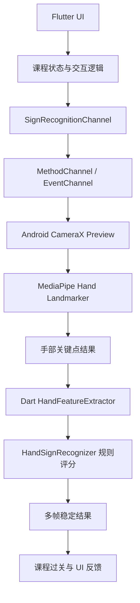

<div align="center">
  

  <h1>Silent Voice</h1>
  <p><strong>一款面向校园公益场景的手语学习与实时识别 App</strong></p>

  <p>
    
    
    
    
  </p>

  <p>
    <a href="#项目亮点">项目亮点</a> ·
    <a href="#核心功能">核心功能</a> ·
    <a href="#技术架构">技术架构</a> ·
    <a href="#快速开始">快速开始</a> ·
    <a href="#路线图">路线图</a>
  </p>
</div>

---

## 项目愿景

**Silent Voice** 希望把手语学习从静态宣传变成一次可以亲手参与的互动体验。它以柔和的视觉叙事、课程地图、实时镜头识别和动作反馈为核心，让第一次接触手语的用户，也能在短时间内完成从“看见动作”到“尝试表达”的转变。

项目当前围绕校园公益展示、手语入门教学和现场互动体验设计，适合作为公益活动展台、课程答辩、无障碍沟通主题展示或移动端交互原型。

## 项目亮点

| 体验层 | 亮点 | 说明 |
| --- | --- | --- |
| 沉浸式首页 | 柔和玻璃质感与纪念碑式空间 | 用低压、友好的视觉语言建立公益主题氛围 |
| 课程地图 | 7 个基础词汇渐进学习 | 当前覆盖“我、爱、南、开、你好、谢谢、没有” |
| 实时识别 | CameraX + MediaPipe 手部关键点 | Android 原生相机采集，Flutter 侧完成动作规则判定 |
| 学习反馈 | 多帧稳定器与过关机制 | 避免单帧误判，让课程闯关更适合现场演示 |
| 动作建议 | 面向初学者的练习提示 | 围绕手形、位置、节奏、镜头距离与稳定性给出建议 |

## 核心功能

### 1. 手语课程地图

课程以章节路线组织，每个节点包含词汇、标签、时长、难度、动作说明、学习状态与进度反馈。用户可以从地图节点进入学习弹窗，查看动作示意并直接启动识别练习。

### 2. 实时镜头练习

App 使用 Android 原生预览承载摄像头画面，通过平台通道向 Flutter 推送手部关键点、置信度、左右手信息、帧尺寸与时间戳。Dart 侧的识别器会将关键点转化为手形、位置、距离与运动方向特征，再输出稳定后的词汇结果。

### 3. 目标词过关

课程练习可指定目标词。当识别结果稳定匹配当前课程词汇时，App 会触发课程通过反馈，并推动顺序学习进度。

### 4. 公益故事页

故事页用于解释项目与无障碍沟通议题的关系，让产品不只是一个识别 demo，而是一个完整的公益传播入口。

## 支持词汇

| 词汇 | 课程标签 | 动作说明 |
| --- | --- | --- |
| 我 | 自我指向 | 单手伸出食指，轻轻指向自己胸前 |
| 爱 | 情感表达 | 双手配合，一手突出拇指，另一手靠近并轻扫 |
| 南 | 方向方位 | 单手四指并拢向下，拇指收起，保持手形稳定 |
| 开 | 动作展开 | 双手先靠近放好，再向左右两侧明确拉开 |
| 你好 | 基础问候 | 单手先做指向动作，再切换到后半段手形 |
| 谢谢 | 礼貌回应 | 单手做出拇指手形，向下送出一个清楚动作 |
| 没有 | 缺失表达 | 拇指、食指和中指靠拢，做清楚的捻合动作 |

## 技术架构



| 模块 | 技术 | 作用 |
| --- | --- | --- |
| 应用框架 | Flutter / Dart | 构建跨端界面、课程地图、练习页与故事页 |
| 原生相机 | Android CameraX | 提供稳定的前置相机预览与图像分析流 |
| 手部检测 | MediaPipe Tasks Vision | 提取 21 点手部关键点 |
| 平台通信 | MethodChannel / EventChannel | 控制识别生命周期并推送实时结果 |
| 规则识别 | Dart 特征提取与评分器 | 根据手形、位置、双手距离、运动方向识别词汇 |
| 视觉资源 | flutter_svg / Google Fonts | 承载手语示意图与中文视觉风格 |

## 项目结构

```text
lib/
  main.dart                              # 应用入口与底部导航
  src/
    home/immersive_home_screen.dart      # 沉浸式首页
    course_map/                          # 课程地图、学习弹窗、动作建议
    camera/                              # 相机权限、预览与练习组件
    platform/sign_recognition_channel.dart
    recognizer/                          # Dart 侧手势特征提取与规则识别
    recognition/                         # 识别结果数据结构

android/app/src/main/kotlin/
  com/example/my_app/
    camera/                              # CameraX 预览与分析控制器
    recognition/                         # MediaPipe / mock 识别引擎

assets/
  fig/                                   # 手语 SVG 示意图
  models/hand_landmarker.task            # MediaPipe 手部关键点模型

docs/
  project_proposal.pdf                   # 项目立项文档

silent-voice-hero.png                    # README 横幅图
```

## 快速开始

### 环境要求

- Flutter SDK `3.x`
- Dart SDK `^3.11.4`
- Android Studio 或可用的 Android SDK
- 一台带摄像头的 Android 真机，实时识别体验不建议只依赖模拟器

### 安装依赖

```bash
flutter pub get
```

### 运行项目

```bash
flutter run
```

### 构建 Android 包

```bash
flutter build apk
```

## 识别链路说明

1. 用户打开课程练习或实时练习页。
2. App 请求相机权限并挂载 Android 原生预览。
3. CameraX 将图像帧送入 MediaPipe Hand Landmarker。
4. 原生层通过 EventChannel 推送关键点与置信度。
5. Flutter 侧提取手形、位置、距离、运动方向等特征。
6. 规则识别器对 7 个目标词评分，并用最近多帧做稳定化。
7. 稳定识别结果驱动课程反馈、目标词过关与学习进度。

## 生产化注意

- 外部 AI 建议服务建议迁移到后端代理或安全的环境变量方案，避免在客户端公开密钥。
- 真实活动展示前，需要用目标 Android 设备做相机方向、光线、距离和识别阈值测试。
- 当前词库适合原型演示；扩展词汇时建议同步补充样本、规则、示意图和回归测试。

## 路线图

- [x] 沉浸式首页与故事页
- [x] 课程地图与顺序学习进度
- [x] Android 原生相机预览
- [x] MediaPipe Hand Landmarker 接入
- [x] 7 个基础词汇规则识别
- [ ] 扩展更多日常手语词汇
- [ ] 将识别规则参数配置化
- [ ] 增加练习历史与学习成就
- [ ] 完善 iOS 原生识别链路
- [ ] 增加自动化识别规则测试

## 致谢

Silent Voice 受到无障碍沟通、校园公益活动和移动端交互学习产品的启发。项目使用 Flutter、CameraX、MediaPipe 等开源生态能力构建，也感谢所有推动手语学习与信息无障碍的人。
