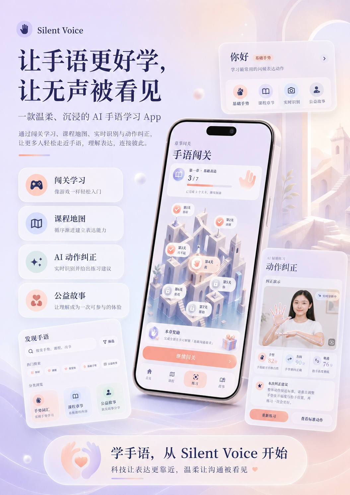
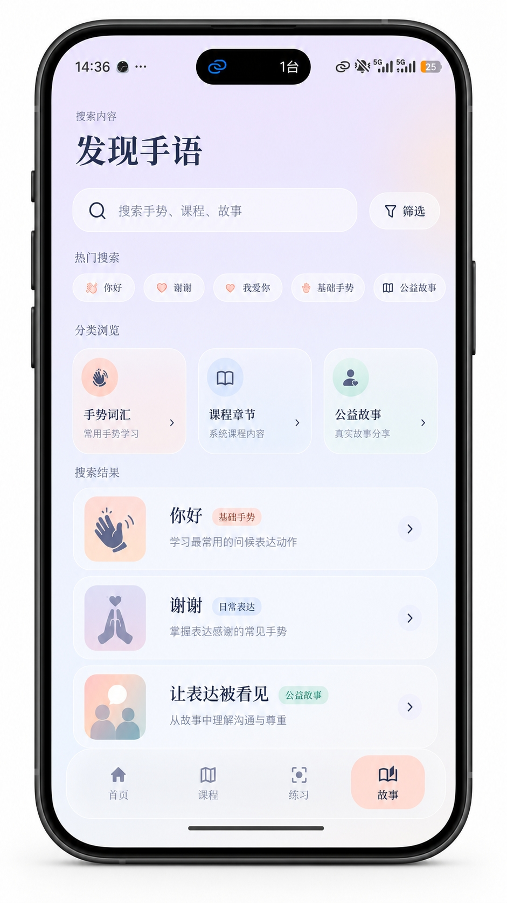
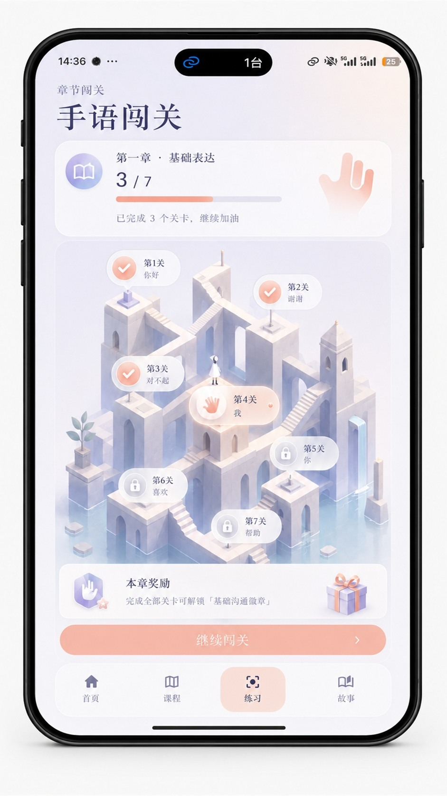
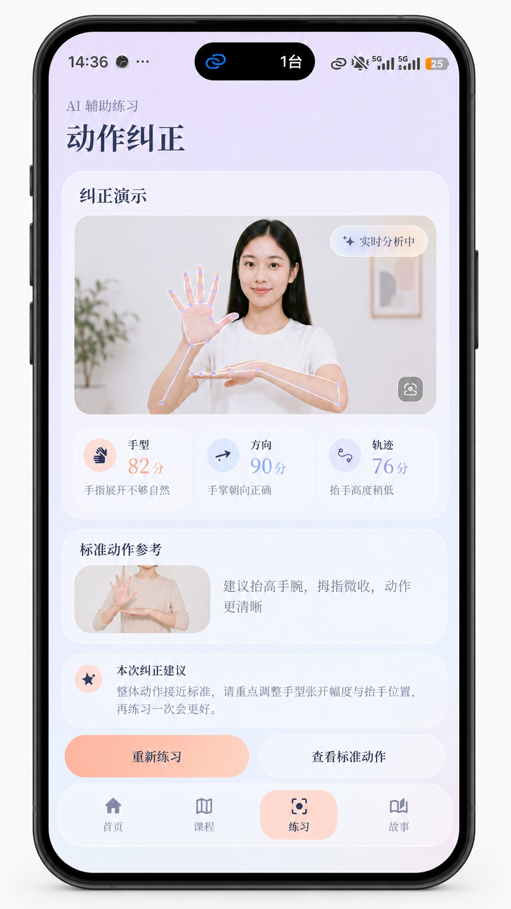
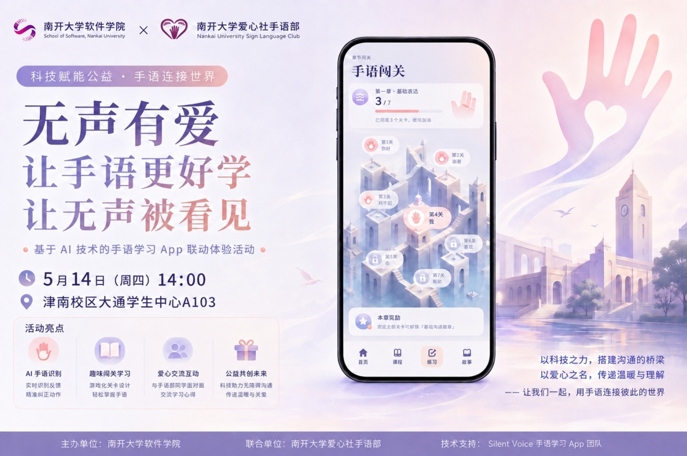
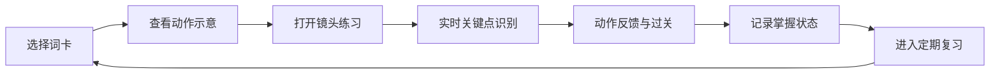
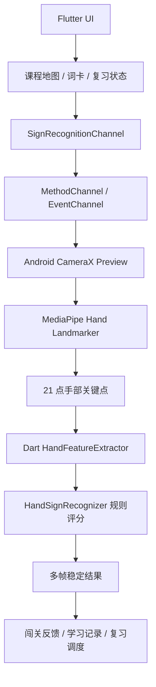

<p align="center">
  
</p>

<div align="center">

  <h3>让手语更好学，让无声被看见</h3>
  <p>
    面向大众公益教育的 <strong>手语闯关 App</strong>，
    也是面向真实学习需求的 <strong>手语词卡手册</strong>。
  </p>

  <p>
    
  </p>

  <p>
    
    
    
  </p>

  <p>
    
    
    
    
    
  </p>

  <p>
    <a href="#-产品定位">产品定位</a> ·
    <a href="#-产品展示">产品展示</a> ·
    <a href="#-核心能力">核心能力</a> ·
    <a href="#-词库体系">词库体系</a> ·
    <a href="#-技术架构">技术架构</a> ·
    <a href="#-快速开始">快速开始</a>
  </p>

</div>



---

## ✦ 产品定位

**Silent Voice** 的定位不是“识别几个手势的 Demo”，而是一个可以持续扩展的手语学习产品原型：

- 面向健康人群和健听人群：用闯关、故事和实时识别做手语教育宣传，让第一次接触手语的人愿意学、敢尝试、能理解无障碍沟通。
- 面向有手语学习需求者：提供类似英语单词 App 的手语词卡手册，用分类词库、定期复习、动作示意和练习反馈支撑长期学习。
- 面向校园公益活动：把“科技赋能公益”落到可扫码、可体验、可传播、可答辩的完整产品叙事里。

> [!IMPORTANT]
> 当前工程已经跑通首页、课程地图、相机识别、动作反馈和首批词条闯关。首批词条用于验证学习链路，产品设计目标是覆盖大部分生活常用手语词汇，而不是停留在固定的几个动作。

## ✦ 产品展示

<table>
  <tr>
    <td width="33%" align="center">
      
      <br />
      <strong>发现手语</strong>
      <br />
      <sub>像单词 App 一样搜索、分类和浏览手语词卡</sub>
    </td>
    <td width="33%" align="center">
      
      <br />
      <strong>手语闯关</strong>
      <br />
      <sub>用游戏化路线完成公益宣传和入门学习</sub>
    </td>
    <td width="33%" align="center">
      
      <br />
      <strong>动作纠正</strong>
      <br />
      <sub>实时分析手形、方向和动作轨迹</sub>
    </td>
  </tr>
</table>

<details>
<summary><strong>公益活动物料示例</strong></summary>
<br />

</details>

## ✦ 核心能力

| 能力 | 面向谁 | 价值 |
| --- | --- | --- |
| 手语闯关 | 健康人群、健听人群、活动参与者 | 用低门槛游戏化体验完成手语教育宣传 |
| 词卡手册 | 有手语学习需求者、志愿者、服务者 | 把生活常用手语沉淀为可长期学习的词汇资产 |
| 定期复习 | 长期学习用户 | 按掌握度组织“今日学习、待复习、需巩固、已掌握” |
| 实时识别 | 所有练习用户 | 通过相机与关键点识别判断动作是否接近标准 |
| 动作纠正 | 初学者 | 围绕手形、方向、节奏、位置、镜头距离给出反馈 |
| 公益故事 | 活动组织者、展示现场 | 让技术展示转化为对无障碍沟通的理解与参与 |

## ✦ 当前实现

当前仓库已经落地了一条完整的端到端体验链路：

- Flutter 首页、课程地图、练习页、故事页和底部导航。
- Android 原生相机预览与 CameraX 图像分析流。
- MediaPipe Hand Landmarker 手部关键点检测。
- Flutter `MethodChannel` / `EventChannel` 实时接收识别结果。
- Dart 侧手势特征提取、规则评分和多帧稳定。
- 课程目标词匹配、过关反馈和顺序学习进度。
- 首批示范词条：`我`、`爱`、`南`、`开`、`你好`、`谢谢`、`没有`。

首批词条不是能力上限，而是用于验证识别链路、课程结构和反馈体验。后续可通过词条配置、示意资源、规则参数和样本采集持续扩展到大规模生活常用词库。

## ✦ 词库体系

Silent Voice 的词库设计更接近“手语版单词书”。每个词条都可以被学习、收藏、复习、练习和识别。

| 词库层级 | 示例内容 | 学习价值 |
| --- | --- | --- |
| 入门表达 | 我、你、你好、谢谢、没有、可以、帮助 | 快速建立基础交流能力 |
| 日常生活 | 吃饭、喝水、回家、学校、医院、公交、手机、钱 | 覆盖常见生活场景 |
| 情绪与关系 | 开心、难过、喜欢、爱、朋友、家人、老师、同学 | 支持更自然的人际表达 |
| 校园与公益 | 活动、志愿者、报名、集合、讲解、体验、无障碍 | 服务校园活动和宣传场景 |
| 公共服务 | 求助、危险、厕所、方向、时间、数字、等待 | 面向真实环境中的沟通需求 |

```text
词条 = 名称 + 分类 + 难度 + 动作说明 + 示意图/视频
     + 识别规则/模型标签 + 学习状态 + 复习周期 + 掌握度
```

## ✦ 学习闭环



这套闭环让 Silent Voice 同时适合两种节奏：

- 短时活动：用户在展台上完成几个词的闯关，快速理解手语和无障碍沟通。
- 长期学习：用户每天学习和复习词卡，逐步积累生活常用手语词汇。

## ✦ 技术架构



| 模块 | 技术 | 作用 |
| --- | --- | --- |
| 应用框架 | Flutter / Dart | 构建跨端界面、课程地图、词卡手册、练习页与故事页 |
| 原生相机 | Android CameraX | 提供稳定的前置相机预览与图像分析流 |
| 手部检测 | MediaPipe Tasks Vision | 提取手部 21 点关键点，为手势判断提供基础数据 |
| 平台通信 | MethodChannel / EventChannel | 控制识别生命周期并推送实时结果 |
| 规则识别 | Dart 特征提取与评分器 | 根据手形、位置、双手距离、运动方向识别词汇 |
| 学习系统 | 课程状态与复习状态 | 支持闯关、学习进度、词卡掌握度和后续复习扩展 |

## ✦ 项目结构

```text
lib/
  main.dart                              # 应用入口与底部导航
  src/
    home/immersive_home_screen.dart      # 沉浸式首页
    course_map/                          # 课程地图、学习弹窗、动作建议
    camera/                              # 相机权限、预览与练习组件
    platform/sign_recognition_channel.dart
    recognizer/                          # Dart 侧手势特征提取与规则识别
    recognition/                         # 识别结果数据结构

android/app/src/main/kotlin/
  com/example/my_app/
    camera/                              # CameraX 预览与分析控制器
    recognition/                         # MediaPipe / mock 识别引擎

assets/
  fig/                                   # 手语 SVG 示意图
  models/hand_landmarker.task            # MediaPipe 手部关键点模型

.github/readme/                          # README 展示资源
```

## ✦ 快速开始

### 环境要求

- Flutter SDK `3.x`
- Dart SDK `^3.11.4`
- Android Studio 或可用的 Android SDK
- 一台带摄像头的 Android 真机，实时识别体验不建议只依赖模拟器

### 安装依赖

```bash
flutter pub get
```

### 运行项目

```bash
flutter run
```

### 构建 Android 包

```bash
flutter build apk
```

## ✦ Roadmap

- [x] 沉浸式首页与公益故事页
- [x] 闯关式课程地图与顺序学习进度
- [x] Android 原生相机预览
- [x] MediaPipe Hand Landmarker 接入
- [x] 首批词条规则识别与过关反馈
- [ ] 建立可配置词卡数据结构
- [ ] 扩展生活常用手语词库
- [ ] 增加“今日学习 / 定期复习 / 掌握度”机制
- [ ] 支持视频示范、错题本和学习 streak
- [ ] 将识别规则参数配置化，降低新增词条成本
- [ ] 完善 iOS 原生识别链路
- [ ] 引入更多样本和自动化识别回归测试

## ✦ 生产化注意

> [!WARNING]
> 外部 AI 建议服务应迁移到后端代理或安全的环境变量方案，避免在客户端公开密钥。

- 真实活动展示前，需要用目标 Android 设备测试相机方向、光线、距离和识别阈值。
- 扩展大词库时，建议同步建设词条数据、示意资源、规则参数、样本采集和回归测试体系。
- 面向残障人士的正式教学内容应尽量引入专业手语老师或相关组织参与校对。

## ✦ 致谢

Silent Voice 受到无障碍沟通、校园公益活动、英语单词学习 App 和移动端交互学习产品的启发。项目使用 Flutter、CameraX、MediaPipe 等开源生态能力构建，也感谢所有推动手语学习与信息无障碍的人。

<p align="center">
  
</p>
