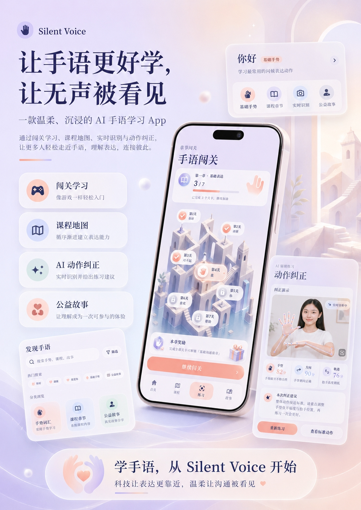
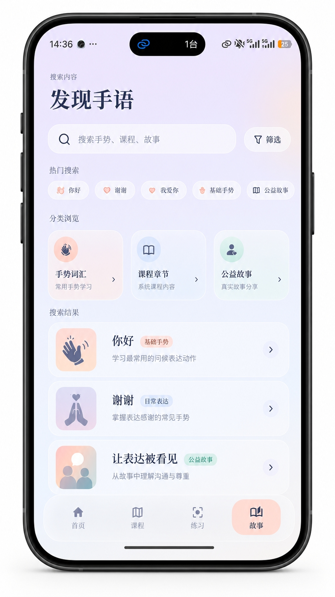
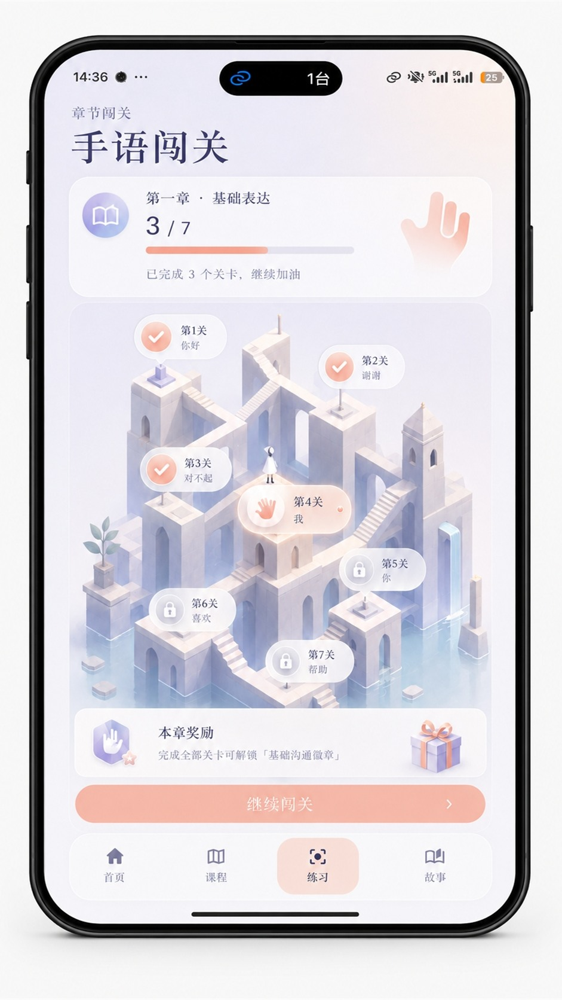
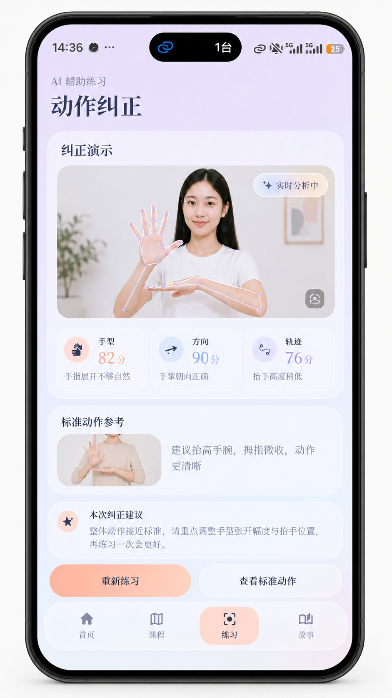
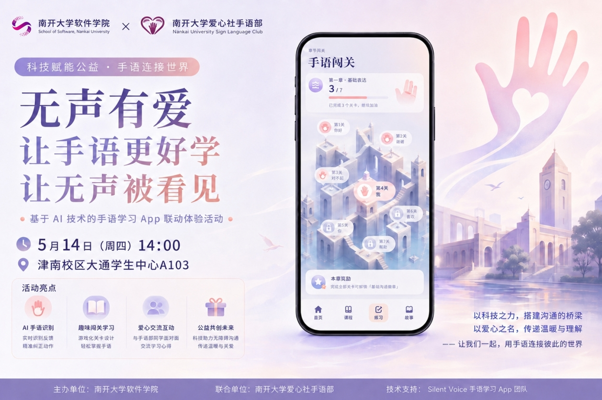
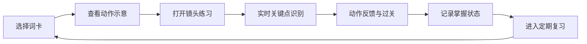
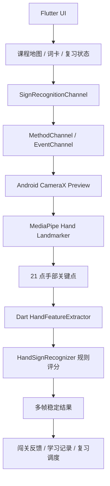

<p align="center">
  
</p>

<div align="center">

  <h3>让手语更好学，让无声被看见</h3>
  <p>
    以闯关激发第一次尝试，以词卡与 AI 练习陪伴长期学习。<br />
    面向手语初学者、校园公益活动与无障碍沟通场景。
  </p>

  <p>
    
  </p>

  <p>
    
    
    
    
  </p>

  <p>
    
    
    
    
    
  </p>

  <p>
    <a href="#-赛事荣誉">赛事荣誉</a> ·
    <a href="#-产品定位">产品定位</a> ·
    <a href="#-产品展示">产品展示</a> ·
    <a href="#-核心能力">核心能力</a> ·
    <a href="#-词库体系">词库体系</a> ·
    <a href="#-技术架构">技术架构</a> ·
    <a href="#-快速开始">快速开始</a>
  </p>

</div>



---

## ✦ 赛事荣誉

> [!TIP]
> **中国高校计算机大赛 AIGC 创新赛 · 华北赛区一等奖**

Silent Voice 围绕手语学习与无障碍沟通，将移动端交互、实时手部关键点识别和游戏化学习路径组合为可现场体验、可持续扩展的产品原型。

| 项目亮点 | 具体表达 |
| --- | --- |
| 学习体验 | 用闯关降低首次接触门槛，用词卡与复习机制承接长期学习 |
| 技术闭环 | 串联 CameraX、MediaPipe、跨端通信、规则评分与多帧稳定 |
| 公益场景 | 服务校园展示、志愿活动与日常无障碍沟通教育 |
| 扩展能力 | 通过词条、示意资源、识别参数和样本体系持续扩充内容 |

## ✦ 产品定位

**Silent Voice** 是一个面向手语学习与无障碍沟通的移动端产品原型。它不止展示单次识别结果，更关注从“认识一个词”到“练会一个词”的完整过程：

- **面向手语初学者**：通过闯关、故事和实时反馈降低第一次学习的心理与操作门槛。
- **面向持续学习者**：以分类词卡、动作示意、掌握度和定期复习支撑日常积累。
- **面向校园公益场景**：提供可体验、可展示、可传播的互动载体，让无障碍沟通被更多人理解和参与。

> [!IMPORTANT]
> 当前版本已打通首页、课程地图、相机识别、动作反馈和首批词条闯关。后续可沿用现有链路扩充词条配置、示意资源、识别参数与训练样本，逐步覆盖更多生活场景。

## ✦ 产品展示

<table>
  <tr>
    <td width="33%" align="center">
      
      <br />
      <strong>发现手语</strong>
      <br />
      <sub>像单词 App 一样搜索、分类和浏览手语词卡</sub>
    </td>
    <td width="33%" align="center">
      
      <br />
      <strong>手语闯关</strong>
      <br />
      <sub>用游戏化路线完成公益宣传和入门学习</sub>
    </td>
    <td width="33%" align="center">
      
      <br />
      <strong>动作纠正</strong>
      <br />
      <sub>实时分析手形、方向和动作轨迹</sub>
    </td>
  </tr>
</table>

<details>
<summary><strong>公益活动物料示例</strong></summary>
<br />

</details>

## ✦ 核心能力

| 能力 | 面向谁 | 价值 |
| --- | --- | --- |
| 手语闯关 | 手语初学者、健听公众、活动参与者 | 用低门槛游戏化体验完成手语教育宣传 |
| 词卡手册 | 有手语学习需求者、志愿者、服务者 | 把生活常用手语沉淀为可长期学习的词汇资产 |
| 定期复习 | 长期学习用户 | 按掌握度组织“今日学习、待复习、需巩固、已掌握” |
| 实时识别 | 所有练习用户 | 通过相机与关键点识别判断动作是否接近标准 |
| 动作纠正 | 初学者 | 围绕手形、方向、节奏、位置、镜头距离给出反馈 |
| 公益故事 | 活动组织者、展示现场 | 让技术展示转化为对无障碍沟通的理解与参与 |

## ✦ 当前实现

当前版本已打通从“查看示意”到“镜头练习、实时反馈、课程过关”的核心体验链路：

- Flutter 首页、课程地图、练习页、故事页和底部导航。
- Android 原生相机预览与 CameraX 图像分析流。
- MediaPipe Hand Landmarker 手部关键点检测。
- Flutter `MethodChannel` / `EventChannel` 实时接收识别结果。
- Dart 侧手势特征提取、规则评分和多帧稳定。
- 课程目标词匹配、过关反馈和顺序学习进度。
- 首批示范词条：`我`、`爱`、`南`、`开`、`你好`、`谢谢`、`没有`。

首批词条用于验证识别链路、课程结构和反馈体验。当前识别以关键点特征与规则评分为主，后续可通过词条配置、示意资源、参数管理和样本采集持续提升覆盖范围与稳定性。

## ✦ 词库体系

Silent Voice 将词库组织为“可发现、可学习、可练习、可复习”的手语单词书。每个词条都可以承载动作示意、识别规则和个人学习状态。

| 词库层级 | 示例内容 | 学习价值 |
| --- | --- | --- |
| 入门表达 | 我、你、你好、谢谢、没有、可以、帮助 | 快速建立基础交流能力 |
| 日常生活 | 吃饭、喝水、回家、学校、医院、公交、手机、钱 | 覆盖常见生活场景 |
| 情绪与关系 | 开心、难过、喜欢、爱、朋友、家人、老师、同学 | 支持更自然的人际表达 |
| 校园与公益 | 活动、志愿者、报名、集合、讲解、体验、无障碍 | 服务校园活动和宣传场景 |
| 公共服务 | 求助、危险、厕所、方向、时间、数字、等待 | 面向真实环境中的沟通需求 |

```text
词条 = 名称 + 分类 + 难度 + 动作说明 + 示意图/视频
     + 识别规则/模型标签 + 学习状态 + 复习周期 + 掌握度
```

## ✦ 学习闭环


```mermaid
flowchart LR
    A["选择词卡"] --> B["查看动作示意"]
    B --> C["打开镜头练习"]
    C --> D["实时关键点识别"]
    D --> E["动作反馈与过关"]
    E --> F["记录掌握状态"]
    F --> G["进入定期复习"]
    G --> A
```

这套闭环让 Silent Voice 同时适合两种节奏：

- **现场体验**：在展台或公益活动中完成一组词汇闯关，快速建立对手语与无障碍沟通的认识。
- **持续学习**：按日学习和复习词卡，用掌握度记录逐步积累生活常用词汇。

## ✦ 技术架构


```mermaid
flowchart TD
    A["Flutter UI"] --> B["课程地图 / 词卡 / 复习状态"]
    B --> C["SignRecognitionChannel"]
    C --> D["MethodChannel / EventChannel"]
    D --> E["Android CameraX Preview"]
    E --> F["MediaPipe Hand Landmarker"]
    F --> G["21 点手部关键点"]
    G --> H["Dart HandFeatureExtractor"]
    H --> I["HandSignRecognizer 规则评分"]
    I --> J["多帧稳定结果"]
    J --> K["闯关反馈 / 学习记录 / 复习调度"]
```

| 模块 | 技术 | 作用 |
| --- | --- | --- |
| 应用框架 | Flutter / Dart | 构建跨端界面、课程地图、词卡手册、练习页与故事页 |
| 原生相机 | Android CameraX | 提供稳定的前置相机预览与图像分析流 |
| 手部检测 | MediaPipe Tasks Vision | 提取手部 21 点关键点，为手势判断提供基础数据 |
| 平台通信 | MethodChannel / EventChannel | 控制识别生命周期并推送实时结果 |
| 规则识别 | Dart 特征提取与评分器 | 根据手形、位置、双手距离、运动方向识别词汇 |
| 学习系统 | 课程状态与复习状态 | 支持闯关、学习进度、词卡掌握度和后续复习扩展 |

## ✦ 项目结构

```text
lib/
  main.dart                              # 应用入口与底部导航
  src/
    home/immersive_home_screen.dart      # 沉浸式首页
    course_map/                          # 课程地图、学习弹窗、动作建议
    camera/                              # 相机权限、预览与练习组件
    platform/sign_recognition_channel.dart
    recognizer/                          # Dart 侧手势特征提取与规则识别
    recognition/                         # 识别结果数据结构

android/app/src/main/kotlin/
  com/example/my_app/
    camera/                              # CameraX 预览与分析控制器
    recognition/                         # MediaPipe / mock 识别引擎

assets/
  fig/                                   # 手语 SVG 示意图
  models/hand_landmarker.task            # MediaPipe 手部关键点模型

.github/readme/                          # README 展示资源
```

## ✦ 快速开始

### 环境要求

- Flutter SDK `3.x`
- Dart SDK `^3.11.4`
- Android Studio 或可用的 Android SDK
- 一台带摄像头的 Android 真机，实时识别体验不建议只依赖模拟器

### 安装依赖

```bash
flutter pub get
```

### 运行项目

```bash
flutter run
```

### 构建 Android 包

```bash
flutter build apk
```

## ✦ Roadmap

### 已完成

- [x] 沉浸式首页、公益故事页与闯关式课程地图
- [x] Android 原生相机预览与 MediaPipe Hand Landmarker 接入
- [x] 首批词条的规则识别、多帧稳定与过关反馈
- [x] 顺序学习进度和完整练习链路

### 下一步

- [ ] 建立可配置的词卡与识别参数数据结构
- [ ] 扩展生活常用手语词库
- [ ] 增加“今日学习 / 定期复习 / 掌握度”机制
- [ ] 支持视频示范、错题本与连续学习记录

### 长期演进

- [ ] 完善 iOS 原生识别链路
- [ ] 引入更多样本与自动化识别回归测试
- [ ] 建立内容校对、样本采集与版本管理流程

## ✦ 共创与落地

> [!WARNING]
> 若接入外部 AI 服务，应通过后端代理或安全的密钥管理方案调用，避免在客户端暴露凭据。

- 正式教学内容应邀请专业手语教师、听障伙伴或相关组织参与校对，尊重地区差异与实际表达习惯。
- 线下展示前，应使用目标 Android 设备测试相机方向、光线、距离和识别阈值。
- 扩充词库时，应同步维护词条数据、示意资源、识别参数、样本采集与回归测试。

## ✦ 致谢

Silent Voice 受到无障碍沟通、校园公益活动、英语单词学习 App 和移动端交互学习产品的启发。项目使用 Flutter、CameraX、MediaPipe 等开源生态能力构建，也感谢所有推动手语学习与信息无障碍的人。

<p align="center">
  
</p>
